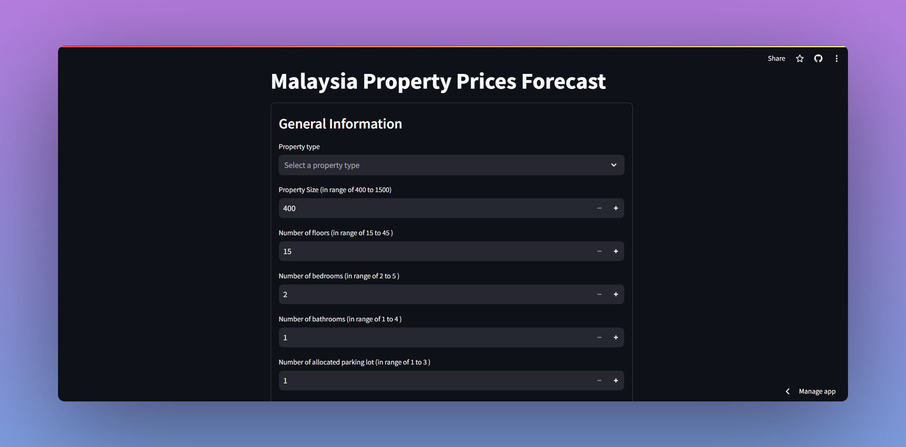

# Malaysia Property Prices Forecast
 

This project utilizes machine learning techniques, including RandomForestRegressor, to accurately forecast property prices across Malaysia. The predictive model is engineered to consider various features such as facilities availability, tenure type, and land title (bumi, non-bumi). The trained model is able to achieve an R-squared score of 0.81. It covers apartments, condominiums, and service residences, catering to diverse market segments. This project provides valuable insights for stakeholders in the real estate industry and empowers informed decision-making.

Dataset used : https://www.kaggle.com/datasets/mcpenguin/raw-malaysian-housing-prices-data 

## Demo video 
 

Live demo : https://malaysia-property-prices-forecast.streamlit.app

## Run Locally 

1) Clone the project 

```bash
  git clone https://github.com/ShaaiRao03/malaysia-property-prices-forecast.git 
```

2) Install Requirements from a Requirements File

```bash
  pip install -r requirements.txt
```

3) Install Streamlit 

```bash
  pip install streamlit
```

4) Run the following command 

```bash
streamlit run app.py
```

5) Access the web through the link provided in the terminal 

## Issues

If you face any issues such as the link is not working and so on, please notify me via shaairao03@gmail.com .

Possible issue : https://discuss.streamlit.io/t/error-running-app-failed-to-download-the-sources-for-repository/49709 
